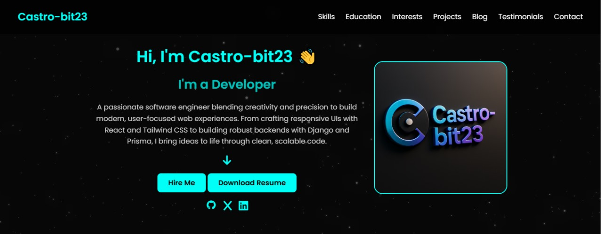

# PLP-PORTFOLIO


Welcome to **Castro-bit23’s Developer Portfolio**, the digital presence of **Fidel Odhiambo** — a passionate and skilled **Software Engineer** based in **Nairobi, Kenya**. This responsive portfolio website is built entirely with **HTML5** and **CSS3** (no JavaScript) and serves as a platform to showcase my work, projects, blog posts, testimonials, and contact information.

🌐 **Live Site**: [https://castro-bit23.github.io/PLP-PORTFOLIO/](https://castro-bit23.github.io/PLP-PORTFOLIO/)

---

## About Me

I'm a dedicated Software Engineer at since April 2021, with a **BSc. in Computer Science**. I specialize in building scalable web applications, focusing on:

- **Web development** (React)
- **Backend development** (Django)
- **CI/CD, UX, and performance tuning**

I've contributed to several impactful apps including **Jahazitech Electrical ltd**, **E-commerce**, and **SmartSpot Web**, all aimed at improving digital health access and usability.

---

## Features

- ✨ Fully static and lightweight — built without JavaScript
- 📱 Mobile responsive design
- 🎨 Clean and professional UI
- 🌙 Light/Dark mode ready structure
- 📂 Pages:
  - `index.html` — Main portfolio homepage
  - `projects.html` — Project gallery with descriptions
  - `blog.html` — Developer blog previews
  - `testimonials.html` — Client & peer testimonials
  - `contact.html` — Contact form and social links

---

## Preview



> Minimalist, modern, and crafted with care.

---

## Getting Started

1. Clone the Repository

```bash
git clone https://github.com/Castro-bit23/PLP-PORTFOLIO.git
cd PLP-PORTFOLIO

2. Customize
Replace images and text as needed within index.html and others. All styling is in css/styles.css.

🌐 GitHub Pages Deployment
This site is automatically published from the main branch using GitHub Pages.

To redeploy:
git add .
git commit -m "Update portfolio"
git push origin main

GitHub Pages will automatically update your site.

Contributing?
While this is a personal project, contributions and suggestions are welcome!

Fork the repo

Create a feature branch

Submit a pull request with your changes

Contact Me
For collaborations, feedback, or opportunities:

📧 Email: fidelcastroodhiambo7@gmail.com

🌍 GitHub: @Castro-bit23

🌍 LinkedIn: https://www.linkedin.com/in/fidel-castro-odhiambo-4233a5220/

"Built from scratch with pure HTML and CSS — proof that simplicity can be powerful."
